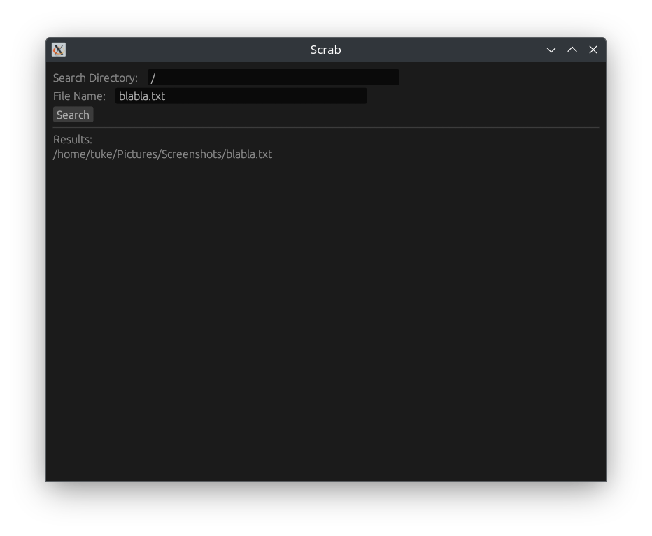

# Scrab



**Scrab** is a file searching tool built in Rust, designed to be fast and efficient for searching files on your system. 

## Features
- Fast file indexing and searching.
- Clean and minimalistic user interface.
- Lightweight and highly performant.

## Installation and Usage

1. **Clone the repository:**
   ```bash
   git clone https://github.com/yourusername/scrab.git
   cd scrab

2. **Build the project:**
   ```bash
   cargo build --release

3. **Run the application:**
   ```bash
   cargo run --release

## Contributing

Contributions are welcome! Feel free to open an issue or submit a pull request if you have any suggestions or improvements to the project.

## License
This Project is licensed under the BSD 3-Clause License - see the [LICENSE](LICENSE) file for details.
